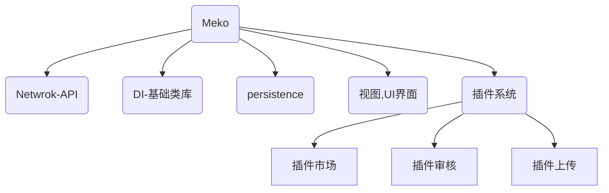

# Meko

> 基于OICQ的机器人

##### 快速开始

安装依赖

```
yarn install
```

* 编译

```shell
yarn build
```

* 编译并运行

```shell
yarn start
```

* 开发

```shell
yarn dev
```

##### 未来展望

1. 开放式插件功能，插件市场Web界面，提供管理插件功能：插件使用次数、插件上传、插件审核(机器人管理员审核通过后即可上架市场)
2. 不止步于OICQ，提供对外网络接口，支持第三方自定义
3. 所有功能基于插件提供，例如群管插件，游戏服务器控制插件

##### 组织结构图


