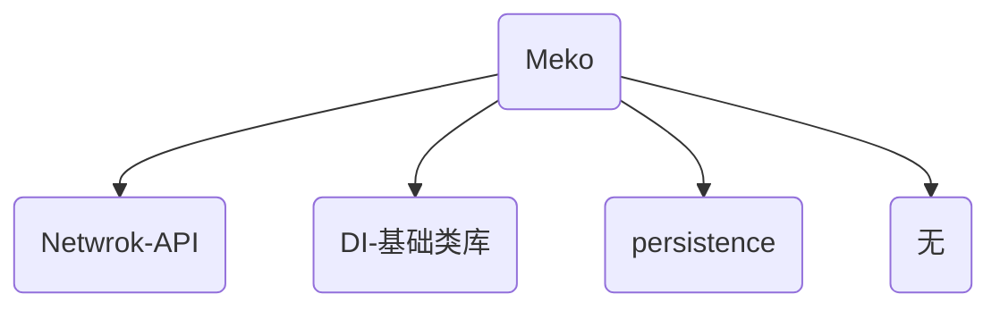

# Meko

> 基于OICQ的机器人

##### 快速开始

安装依赖

```
yarn install
```

* 编译

```shell
yarn build
```

* 编译并运行

```shell
yarn start
```

* 开发

```shell
yarn dev
```

##### 未来展望
无

##### 组织结构图


```mermaid
graph TB
    Meko(Meko)
    Meko-->Netwrok-API(Netwrok-API)
    Meko-->DI(DI-基础类库)
    Meko-->persistence(persistence)
    Meko-->...(无)
```
